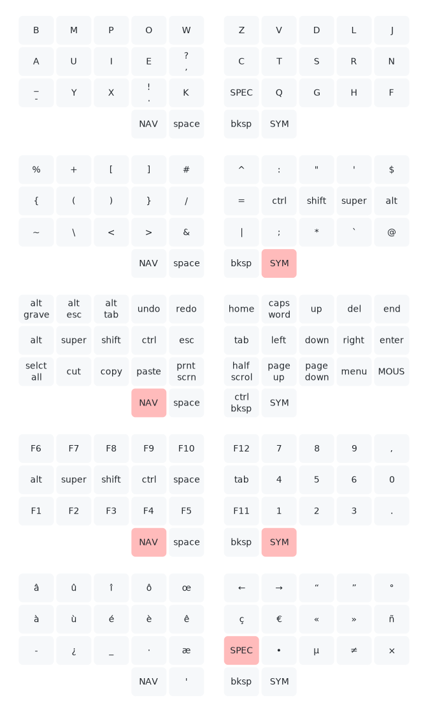

# QMK firmware

This my firmware config for the [Sweep keyboard](https://github.com/davidphilipbarr/Sweep), a split custom keyboard with 34 keys. It makes extensive use of layers to fit all keys.

## Features

- Custom layout optimized for French and English, [Erglace](https://github.com/Lysquid/Erglace) (can be switched with AZERTY)
- A layer for all symbols
- A layer for navigation keys, like the arrow keys
- A tri layer for numbers and function keys
- One shot modifiers, taken from the awesome [Callum's keymap](https://github.com/qmk/qmk_firmware/tree/user-keymaps-still-present/users/callum)
- One shot layer for French accents and useful Unicode characters, inspired by [QWERTY Lafayette](https://qwerty-lafayette.org/)
- A layer to emulate a mouse
- Compilation for QWERTY or AZERTY depending on a config flag (by default, the computer must be set to AZERTY)

## Layers

## Special behaviors

### Modifiers

- The one shot modifiers are on the `NAV` and `SYM` layers. When a mod is tapped, it is queued and will be applied to the next key (for exemple a letter on the base layer).
- Pressing `NAV` or `SYM` again cancels any queued modifier.
- To do the same shortcut multiple times, the modifier can be held. It stays active even if the layer changes.
- `caps word` is a [QMK feature](https://docs.qmk.fm/#/feature_caps_word) that enables caps lock for one word only, useful to write constants.
- Accented letters from the one shot layer can be made uppercase with `shift`.

### Key overrides

Quite a few keys on the left part of the `NAV` layer have a different behavior when used with a modifier. This is meant to fit useful shortcuts, especially those that are usually done with one hand, while the other is on the mouse. For example:

- `alt`+`undo` does `alt`+`tab`, and `alt`+`redo` does `alt`+`shift`+`tab`
- `super`+`undo` goes to the next tab, and `super`+`redo` to the previous one.
- `shift`+`vol+` plays the next song, `shift`+`vol-` the previous one, and `shift`+`play` mutes the sound.
- `ctrl`+`vol+` shuts down the computer, and `ctrl`+`vol-` puts it to sleep (unlikely te be pressed by accident because they use the same finger).

You can see the full list in [overrides.c](keyboards/ferris/keymaps/lysquid/override.c).

### Navigation lock

- Because it is used very often, the `NAV` layer can be locked by pressing `shift` with the thumb when on the layer.
- Alternatively, `shift` and then `NAV` does the same (if shift was not used to make a letter uppercase).
- Any layer key unlocks the layer, except for `SYM` if a modifier is active, to be able to navigate with `super`+`<number>` on a window manager.
- Holding `shift` or pressing `caps word` also disables the layer.

### Mouse layer

- `slow mouse` button make the cursor speed slower for more precision.
- `onesht` buttons stand for 'one shot click'. The mouse layer is disabled after the button is clicked, unlike the other buttons.
- A tap on `NAV`, `SYM` or `shift` exits the mouse layer.
- `erglce` stands for Erglace, my keyboard layout. It can be switched with AZERTY (including the one shot special characters layer, see the [keymap definition](keyboards/ferris/keymaps/lysquid/keymap.c)).

## Installation

- Install the [QMK CLI](https://docs.qmk.fm/#/newbs_getting_started?id=set-up-your-environment) (available on Arch repos as `qmk`)
- Download the latest [release](/releases)
- Run `qmk flash ferris_sweep_lysquid.hex`
- Put your keyboard in bootloader mode (with a `boot` key or a reset button)
- If you are flashing your keyboard for the first time, you must flash the two sides separately with the flags `-bl avrdude-split-left` and `-bl avrdude-split-right`
